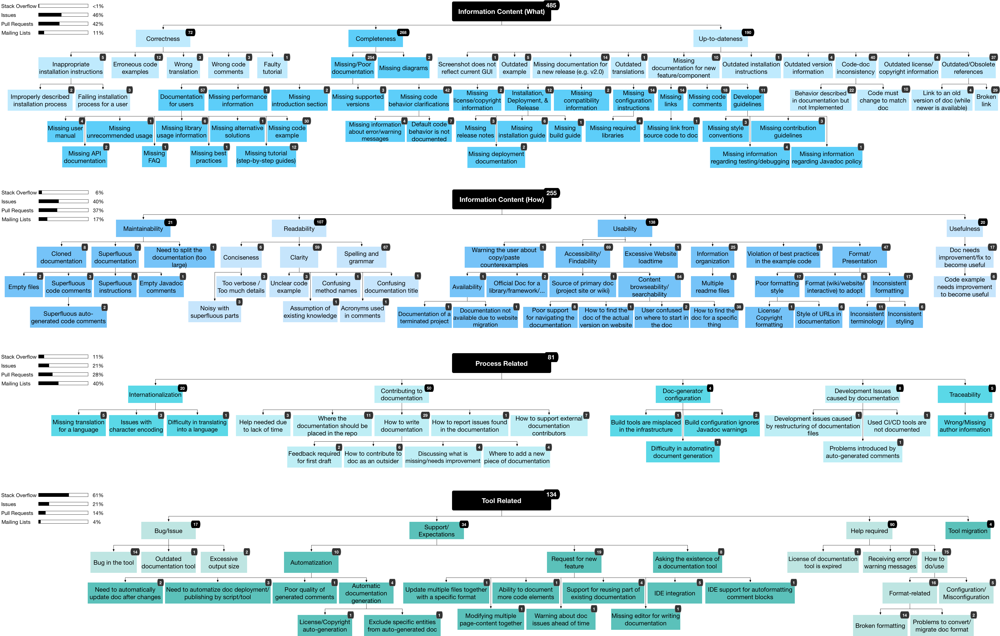

# Replication Package

This repository contains the public data used in the paper "Software Documentation Issues Unveiled":  

## [i.tags-keywords.md](https://github.com/anonymouspaperauthors-ICSE19/replicationpackage/blob/master/i.tags-keywords.md)
Tags and keywords used in the data collection phase

## [ii.predef-and-final-labels.md](https://github.com/anonymouspaperauthors-ICSE19/replicationpackage/blob/master/ii.predef-and-final-labels.md)
List of **predefined** and **final** labels used in the manual analysis.

## [iii.dataset.sqlite.zip](https://github.com/anonymouspaperauthors-ICSE19/replicationpackage/blob/master/iii.dataset.sqlite.zip)
Database of labeled sentences for each artifact.  You can access the data using [DB Browser for SQLite](https://sqlitebrowser.org/) or the [SQLite Manager - Add-ons for Firefox](https://addons.mozilla.org/en-US/firefox/addon/sqlite-manager/) 
